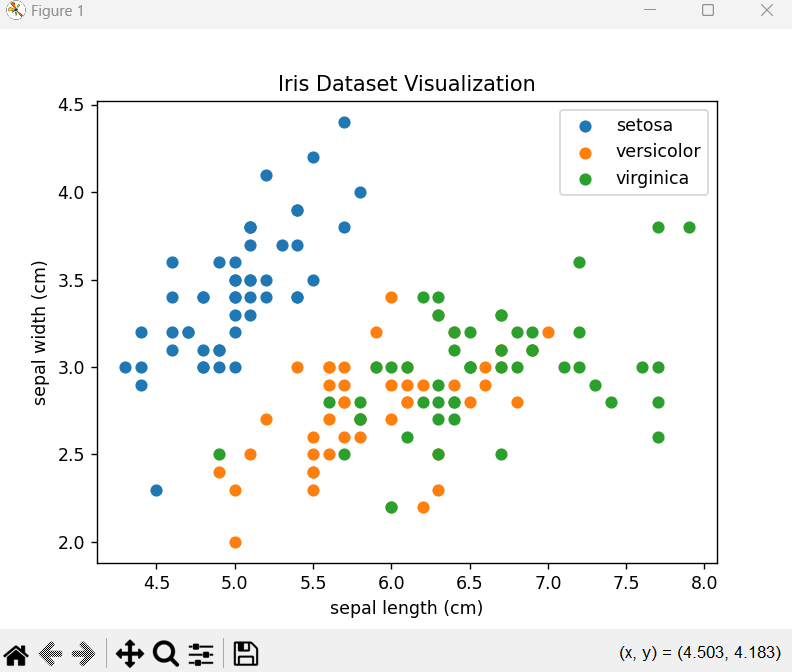
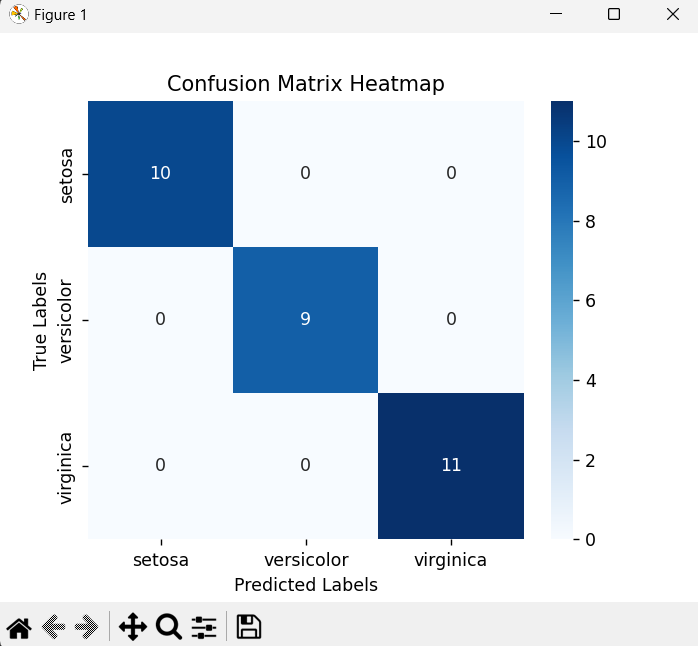
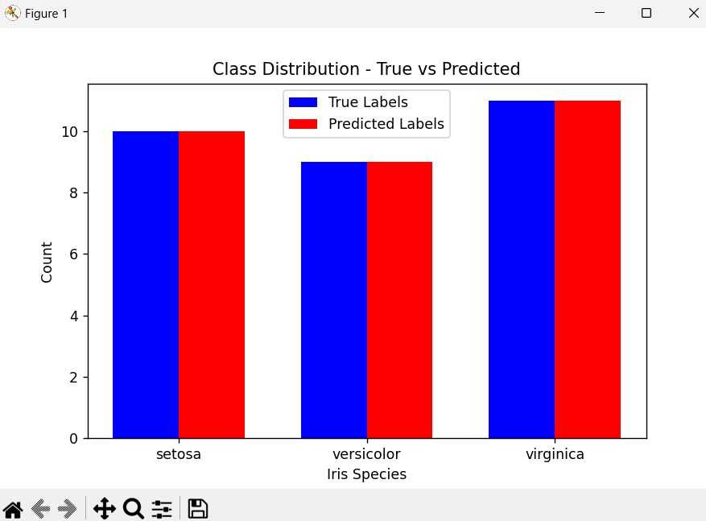
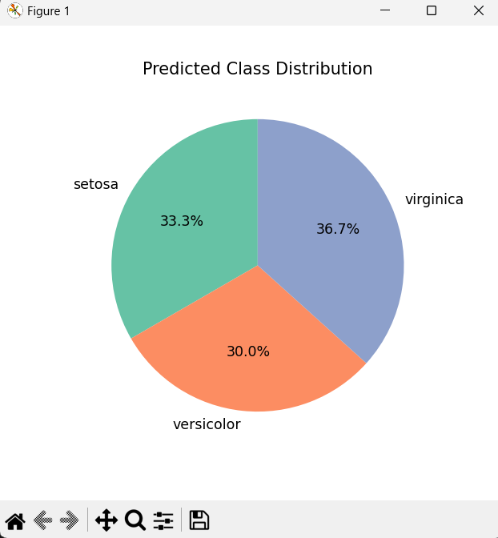

# 🌸 Iris Dataset Classification with Random Forest 🌸

This project demonstrates how to use a Random Forest Classifier to classify the Iris dataset and evaluate the model's performance. The Iris dataset contains measurements of sepals and petals from three species of Iris flowers, and the goal is to predict the species based on these features.

## 📸 Preview:

### Visualizations Included:
1. **Iris Dataset Visualization**:  
   A scatter plot showing the relationship between sepal length and sepal width for different species.  
     
   *Example of Iris dataset visualization.*

2. **Confusion Matrix Heatmap**:  
   A heatmap visualizing the confusion matrix, showing the true vs predicted labels for the Iris species.  
   
   *Example of confusion matrix heatmap.*

3. **Bar Chart - True vs Predicted Labels**:  
   A bar chart comparing the counts of true labels and predicted labels for each Iris species.  
     
   *Example of class distribution bar chart.*

4. **Pie Chart - Predicted Class Distribution**:  
   A pie chart visualizing the percentage distribution of the predicted species.  
     
   *Example of predicted class distribution.*

### Evaluation Metrics:
After running the model, you'll get key metrics:
- **Accuracy**: A single score representing the percentage of correct predictions.
- **Classification Report**: Includes precision, recall, F1-score, and support for each Iris species.

Example output:
```plaintext
Accuracy: 0.9667
Classification Report:
                 precision    recall  f1-score   support

          setosa       1.00      1.00      1.00         10
      versicolor       0.92      1.00      0.96         10
       virginica       1.00      0.90      0.95         10

      accuracy                           0.97         30
     macro avg       0.97      0.97      0.97         30
  weighted avg       0.97      0.97      0.97         30
